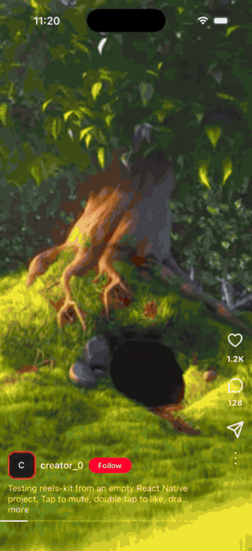
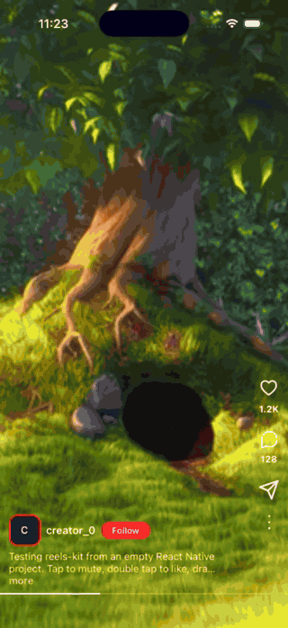
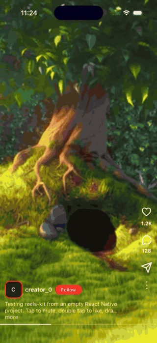
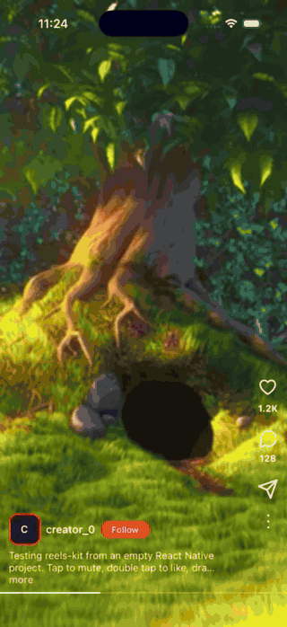

# reels-kit

A vertical, Instagram Reels-style video feed for React Native, built on FlashList 2.
You get the hard parts: snap paging, only a few players mounted at a time, playback that pauses when it should, tap and scrub gestures, and retry on failed loads. The layout around the video is yours to build.

- **Headless building blocks, no fixed layout.** Compose the cell from small components (action buttons, avatar, follow button, caption, scrub bar, overlays) and style them freely.
- **Bring your own video engine.** The core imports no video library. A `react-native-video` adapter ships as `reels-kit/react-native-video`; you can write your own adapter for anything else.
- **Bounded memory.** Only the active reel and its neighbours (`mediaRenderRadius`) mount a native player.
- **No bundled icons or assets.** Every icon is a `ReactNode` you pass in.

## Demo

| Paging | Tap to mute | Double tap to like |
| :---: | :---: | :---: |
|  |  |  |

| Scrub bar | Follow and caption |
| :---: | :---: |
|  |  |

## Status

**Initial release (`0.1.0`).** The feed, gestures and components are ready to use on iOS and Android. As a `0.x` version, the API may still change in minor releases.

Tested on the iOS simulator and on an Android 16 emulator, each in an empty React Native 0.85 app: paging and snapping, video playback through the `react-native-video` adapter, single tap, double tap, scrubbing and seeking, the mute indicator and the headless components. On Android, the load-error state with retry and loading more through `onEndReached` were checked as well. `useCursorPagination` and `useFeedTargetItem` are covered by unit tests.

Not tested yet: physical devices, right-to-left layouts, pull to refresh, `onItemImpression` and the imperative ref. The `expo-video` adapter is a stub and throws if used.

## Requirements

- React Native `>=0.82`, React `>=19`, **New Architecture only**
- `@shopify/flash-list >=2`
- `react-native-reanimated >=4` and `react-native-worklets`
- `react-native-gesture-handler >=3`

Reanimated has to match your React Native version. For example, Reanimated 4.7 requires React Native 0.86+, while 4.5.3 supports 0.83 to 0.86. If `npm install` reports a peer conflict, pin an older Reanimated that supports your React Native.

Tested with React Native 0.85.0, FlashList 2.3.2, Reanimated 4.5.3, worklets 0.11.4, Gesture Handler 3.2.1 and react-native-video 6.19.2.

## Installation

```sh
npm install reels-kit @shopify/flash-list react-native-reanimated react-native-worklets react-native-gesture-handler
```

If you use the bundled `react-native-video` adapter, install it yourself. `reels-kit` never installs a video engine for you:

```sh
npm install react-native-video
```

Then:

1. Add the worklets plugin to `babel.config.js` (it must be listed last):

   ```js
   module.exports = {
     presets: ['module:@react-native/babel-preset'],
     plugins: ['react-native-worklets/plugin'],
   };
   ```

2. Wrap your app in `GestureHandlerRootView` (see the example). `ScrubBar` and the gesture hooks need it.
3. Install the pods: `cd ios && pod install`. On React Native 0.85, keep the project path free of spaces or `pod install` fails.

## Quick start

```tsx
import { useCallback, useRef, useState } from 'react';
import { StyleSheet, View } from 'react-native';
import {
  GestureDetector,
  GestureHandlerRootView,
} from 'react-native-gesture-handler';
import { useRecyclingState } from '@shopify/flash-list';
import {
  FeedActionButton,
  FeedCaption,
  FeedVideoSlot,
  MuteIndicatorOverlay,
  ReelsFeed,
  ScrubBar,
  useFeedTapGesture,
  usePlaybackGate,
} from 'reels-kit';
import type { ReelsFeedRenderItemInfo, ReelVideoHandle } from 'reels-kit';
import { RNVideoAdapter } from 'reels-kit/react-native-video';

interface Reel {
  id: string;
  uri: string;
  caption: string;
}

const REELS: Reel[] = [
  { id: '1', uri: 'https://example.com/a.mp4', caption: 'First reel' },
  { id: '2', uri: 'https://example.com/b.mp4', caption: 'Second reel' },
];

type CellProps = Omit<ReelsFeedRenderItemInfo<Reel>, 'index'> & {
  muted: boolean;
  onToggleMute: () => void;
};

function ReelCell({
  item,
  isActive,
  isFocused,
  isForeground,
  shouldRenderMedia,
  muted,
  onToggleMute,
}: CellProps) {
  // Pause unless this is the active reel, the screen is focused and the app
  // is in the foreground.
  const paused = usePlaybackGate({ isActive, isFocused, isForeground });
  const videoRef = useRef<ReelVideoHandle>(null);

  // Per-cell state that resets when FlashList recycles the cell for a new reel.
  const [time, setTime] = useRecyclingState(0, [item.id]);
  const [duration, setDuration] = useRecyclingState(0, [item.id]);
  const [flash, setFlash] = useRecyclingState(0, [item.id]);

  const gesture = useFeedTapGesture({
    onSingleTap: () => {
      onToggleMute();
      setFlash((n) => n + 1);
    },
  });

  return (
    <View style={styles.cell}>
      <GestureDetector gesture={gesture}>
        <View style={StyleSheet.absoluteFill}>
          {shouldRenderMedia ? (
            <FeedVideoSlot
              ref={videoRef}
              VideoComponent={RNVideoAdapter}
              sourceUri={item.uri}
              paused={paused}
              muted={muted}
              onLoad={(e) => setDuration(e.durationSec)}
              onProgress={(e) => setTime(e.currentTimeSec)}
            />
          ) : null}
        </View>
      </GestureDetector>

      <MuteIndicatorOverlay isMuted={muted} triggerKey={flash} />
      <FeedCaption text={item.caption} style={styles.caption} />
      <ScrubBar
        durationSec={duration}
        currentTimeSec={time}
        onSeek={(seconds) => videoRef.current?.seek(seconds)}
        style={styles.scrubBar}
      />
    </View>
  );
}

export default function App() {
  const [muted, setMuted] = useState(true);
  const toggleMute = useCallback(() => setMuted((m) => !m), []);

  const renderItem = useCallback(
    ({ item, isActive, ...rest }: ReelsFeedRenderItemInfo<Reel>) => (
      <ReelCell
        item={item}
        isActive={isActive}
        isFocused={rest.isFocused}
        isForeground={rest.isForeground}
        shouldRenderMedia={rest.shouldRenderMedia}
        muted={muted}
        onToggleMute={toggleMute}
      />
    ),
    [muted, toggleMute]
  );

  return (
    <GestureHandlerRootView style={styles.root}>
      <ReelsFeed
        data={REELS}
        keyExtractor={(reel) => reel.id}
        renderItem={renderItem}
        extraData={muted}
      />
    </GestureHandlerRootView>
  );
}

const styles = StyleSheet.create({
  root: { flex: 1, backgroundColor: '#000' },
  cell: { flex: 1, backgroundColor: '#000' },
  caption: { position: 'absolute', left: 12, right: 72, bottom: 64 },
  scrubBar: { position: 'absolute', left: 0, right: 0, bottom: 34 },
});
```

`renderItem` receives `{ item, index, isActive, shouldRenderMedia, isFocused, isForeground }`. Mount the video only while `shouldRenderMedia` is true. If your cell depends on state outside `data` (like `muted` above), pass it as `extraData` so the list re-renders.

A fuller demo with likes, an avatar, a follow button and custom SVG icons is in [docs/empty-app-quickstart.md](docs/empty-app-quickstart.md).

## API

### `<ReelsFeed>`

| Prop | Default | Description |
| --- | --- | --- |
| `data`, `keyExtractor`, `renderItem` | required | Items, a stable key, and the cell renderer. |
| `itemHeight` | measured | Page height. Defaults to the measured container height, not the window height. |
| `mediaRenderRadius` | `1` | How many items around the active one get `shouldRenderMedia`. |
| `drawDistance` | page height | FlashList draw distance. |
| `viewabilityThreshold` | `80` | Percent visible for an item to count as active. |
| `isFocused` | `true` | Pass your navigation focus state (for example `useIsFocused()`). |
| `isForeground` | tracked | Override the built-in app foreground tracking. |
| `onActiveIndexChange(index, item)` | | Fires when the active page changes. |
| `onItemImpression(index, item)` | | Fires once per item the first time it becomes active. |
| `onEndReached`, `onEndReachedThreshold` | `0.5` | Load more. |
| `refreshing`, `onRefresh` | | Pull to refresh. |
| `ListEmptyComponent`, `ListFooterComponent` | | Passed to FlashList. |
| `extraData`, `style` | | |

The ref exposes `scrollToIndex`, `scrollToId`, `scrollToTop`, `getActiveIndex` and `getListRef`.

### Building blocks

| Export | Purpose |
| --- | --- |
| `FeedVideoSlot` | Shows a thumbnail until the video is ready, remounts to retry a failed load, and shows a buffering slot. Takes your `VideoComponent`. |
| `FeedActionButton` | An icon with an optional count. `icon` is any `ReactNode`; `countStyle` styles the count. |
| `FeedAvatar` | Circle avatar with a letter fallback. Styles: `style`, `imageStyle`, `fallbackStyle`, `fallbackTextStyle`. |
| `FeedFollowButton` | Follow / Following pill. Styles: `style`, `textStyle`, `followingStyle`, `followingTextStyle`. |
| `FeedCaption` | Caption that truncates with a "more" link. |
| `ScrubBar` | Progress bar you can drag. Animates smoothly between progress updates (`smoothingMs`). |
| `MuteIndicatorOverlay` | Centered icon on a 60% black circle that flashes on each tap. |
| `DoubleTapLikeOverlay` | Heart burst for double tap. |

### Hooks

| Hook | Purpose |
| --- | --- |
| `usePlaybackGate({ isActive, isFocused, isForeground })` | Returns `paused`. |
| `useFeedTapGesture({ onSingleTap, onDoubleTap, enableDoubleTap })` | Single tap with optional double tap, for `GestureDetector`. |
| `useScrubGesture(...)` | The gesture behind `ScrubBar`. |
| `useAppForegroundState()` | Whether the app is in the foreground. |
| `useCursorPagination`, `useFeedTargetItem` | Pagination and "open this item first" helpers. |

Customizing icons, avatar and follow button: [docs/customization.md](docs/customization.md).

### Video adapters

An adapter is a component with this shape, so any engine can be plugged in:

```ts
import type { ReelVideoComponent } from 'reels-kit';
// props: sourceUri, paused, muted, repeat, resizeMode, onLoad, onProgress,
//        onReadyForDisplay, onBuffer, onEnd, onError, audio, style
// ref:   { seek(seconds) }
```

`RNVideoAdapter` (from `reels-kit/react-native-video`) implements it on top of `react-native-video`.

## Contributing

`reels-kit` is open for contributors. Bug reports, fixes, docs and new features are all welcome, whatever the size.

Places where help is most useful right now:

- Testing on Android and on physical devices, and reporting what breaks
- The `expo-video` adapter (currently a stub)
- Right-to-left layouts, pull to refresh and the retry flow
- Tests for `useCursorPagination`, `useFeedTargetItem` and the gesture hooks

Open an [issue](https://github.com/arbab-io/reels-kit/issues) to discuss a change, or send a pull request.

- [Development workflow](CONTRIBUTING.md#development-workflow)
- [Sending a pull request](CONTRIBUTING.md#sending-a-pull-request)
- [Code of conduct](CODE_OF_CONDUCT.md)

## License

Created and owned by arbab-io. Licensed under the [Apache License, Version 2.0](LICENSE).

If you fork or redistribute this project, the license requires you to keep the [NOTICE](NOTICE) attribution and the copyright notices, and to state any changes you made.
